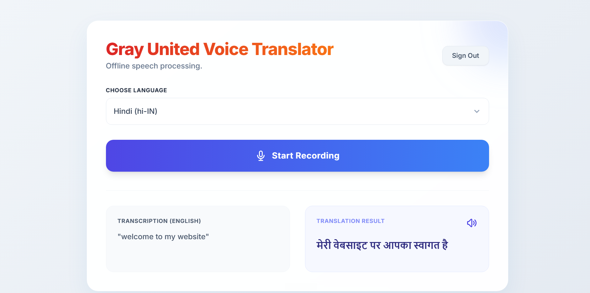
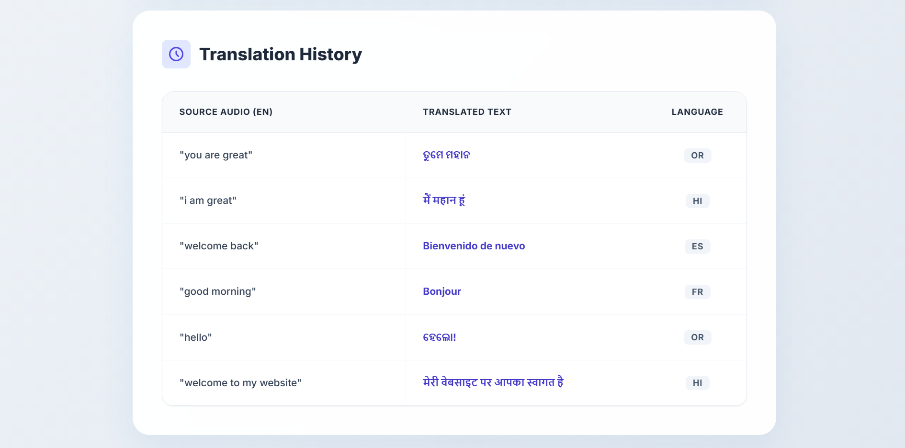
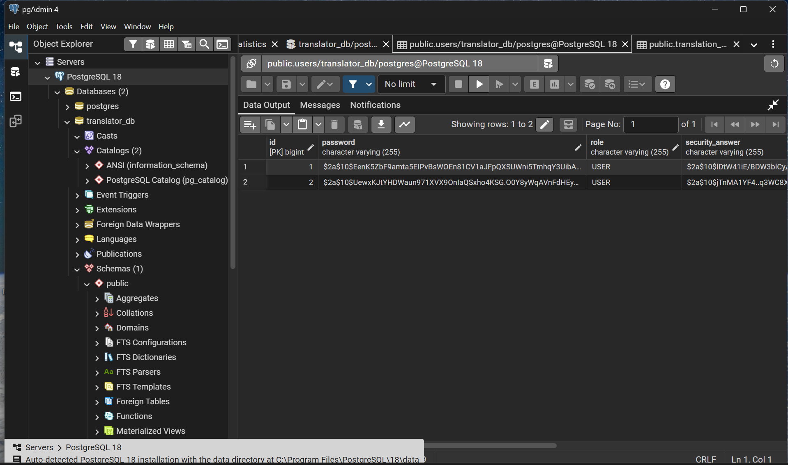

# Gray United Voice Translator 🎙️🌐


A full-stack, web application that provides real-time, offline Automatic Speech Recognition (ASR) and translates it into multiple languages. Built with a focus on secure, enterprise-grade Java development, intelligent state management, and seamless third-party API integration.

## 🚀 Key Features

* **Offline Speech-to-Text (ASR):** Utilizes the Vosk ASR engine loaded directly into the server's RAM for ultra-fast, privacy-centric English transcription without third-party cloud latency.
* **Instant Multilingual Translation:** Integrates with the MyMemory API to accurately translate transcriptions into Hindi, Odia, Spanish, and French.
* **Native Text-to-Speech (TTS):** Leverages the browser's native Web Speech API to read translated text aloud using regional voice synthetics (e.g., `hi-IN`, `fr-FR`).
* **Enterprise Security:** Implements Spring Security with `BCryptPasswordEncoder` to safely manage user credentials, registration, and stateful session-based authentication.
* **Dynamic History Dashboard:** A sleek, asynchronous dashboard that retrieves and displays a user's chronological translation records securely from a PostgreSQL database.
* **Format Forcing Audio Capture:** Uses RecordRTC on the frontend to bypass default browser compression, forcing pure 16kHz Mono WAV audio streams for maximum ASR accuracy.

## 📸 Application Gallery

### 🎙️ Core Translation Interface


### 🕒 Dynamic History Dashboard


### 🔒 Secure Enterprise Authentication
*Featuring masked security questions, BCrypt password hashing, and session management.*
<p align="center">
  
  
</p>

### 🗄️ Encrypted Database Layer
*PostgreSQL integration demonstrating secure BCrypt hashing for both user passwords and account recovery answers.*


## 🛠️ Technology Stack

**Backend Architecture**
* **Language:** Java 25
* **Framework:** Spring Boot 4.x
* **Security:** Spring Security (Stateful Session Management, BCrypt)
* **Data Access:** Spring Data JPA / Hibernate
* **Database:** PostgreSQL

**Frontend Architecture**
* **Core:** HTML5, Vanilla JavaScript (ES6+)
* **Styling:** Tailwind CSS
* **Audio Processing:** RecordRTC.js
* **Web APIs:** Web Speech API (Synthesis), MediaDevices API (`getUserMedia`)

**External Integrations**
* **Vosk API:** Offline acoustic models for speech recognition.
* **MyMemory API:** Free cloud-based translation service.

## 🧠 System Flow

1. **Capture:** The user records audio via the browser microphone. RecordRTC ensures the format is strictly `audio/wav` at `16000Hz`.
2. **Transmission:** The audio Blob is packaged into a `FormData` object and posted to the `/api/translate` REST endpoint.
3. **Transcription:** The Spring Boot controller pipes the audio stream into the Vosk `Recognizer` which extracts the English string.
4. **Translation:** The `TranslationService` fires an HTTP GET request to the MyMemory API with the English text and target language parameters.
5. **Persistence:** The `TranslatorController` binds the transaction to the authenticated `AppUser` and saves the `TranslationRecord` to PostgreSQL.
6. **Delivery:** The translated text is returned to the client as JSON, dynamically updating the UI and enabling the Text-to-Speech module.

## ⚙️ Local Development Setup

### Prerequisites
* Java Development Kit (JDK) 17 or higher
* Apache Maven
* PostgreSQL installed and running on port `5432`

### 1. Database Configuration
Create a new PostgreSQL database named `translator_db`.
Update your `src/main/resources/application.properties` file with your local credentials:

```properties
spring.datasource.url=jdbc:postgresql://localhost:5432/translator_db
spring.datasource.username=postgres
spring.datasource.password=your_password
spring.jpa.hibernate.ddl-auto=update
```

### 2. Vosk Acoustic Model Setup
Due to GitHub file size limits, the Vosk AI models are not included in the repository.
1. Download the lightweight English model: [vosk-model-small-en-us-0.15](https://alphacephei.com/vosk/models)
2. Extract the folder.
3. Place the extracted folder inside `src/main/resources/` and rename it to `vosk-model`.

### 3. Build and Run
Open your terminal in the project root directory and execute:

```bash
mvn clean install
mvn spring-boot:run
```

**Author: Suranjan Kumar Verma**

*Master of Computer Applications (MCA) | KIIT Deemed to be University*
